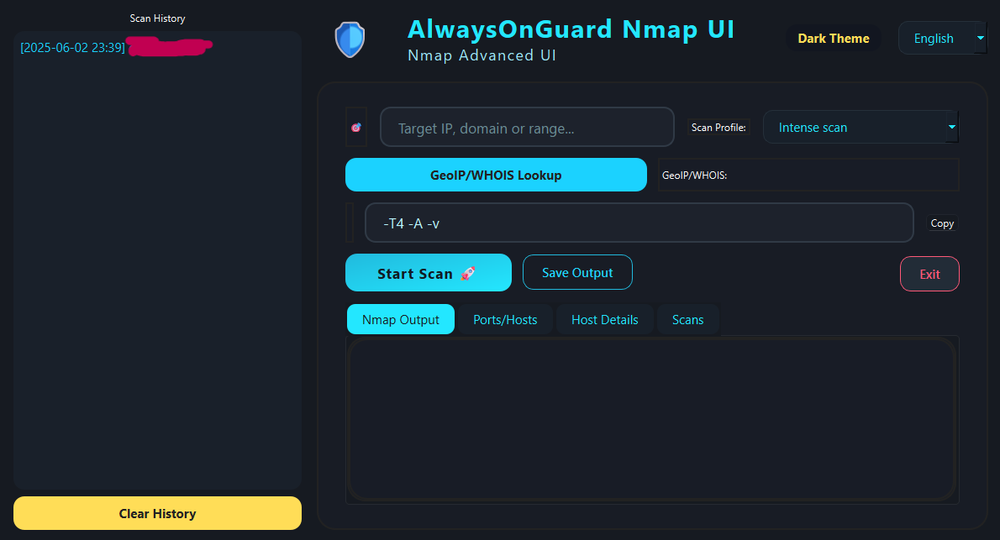
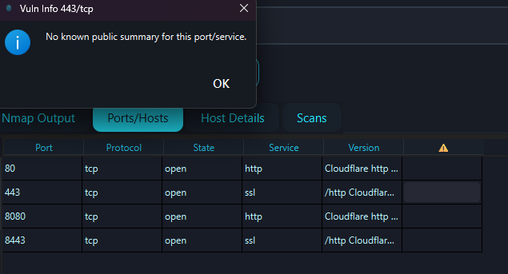
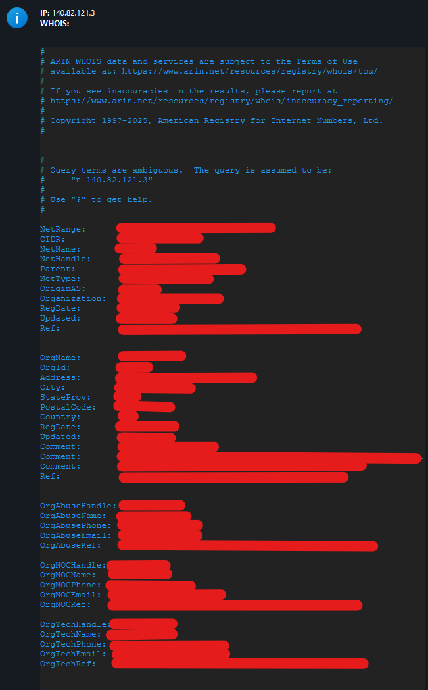

# 🛡️ AlwaysOnGuard Nmap UI

Welcome to **AlwaysOnGuard Nmap UI** — a beautiful, modern, and multi-language graphical interface for Nmap!  
Easily perform advanced network scanning, visualize results, and manage your scan history with style and simplicity. 🚀

---

## ✨ Features

- **Modern & Minimalist Design**  
  Enjoy a clean, elegant GUI with dark and light themes.

- **Multi-Language Support**  
  🌍 English, Türkçe, Deutsch, Español, Français — more to come!

- **Nmap Power, User-Friendly Controls**  
  Select scan profiles, customize commands, and launch scans with a click.

- **Rich Output & Details**  
  📊 View Nmap output, port/services, host details, and vulnerabilities in clear tabs.

- **Scan History**  
  🕑 All your scans are saved locally. Review, delete, or reload any previous scan.

- **Instant GeoIP & WHOIS Lookup**  
  🌐 Instantly get GeoIP and WHOIS info for your targets.

- **Copy, Save & Share**  
  Copy commands/results, save outputs, and share findings with ease.

---

## 🖥️ Screenshots

| Main Window | Vulnerability Tooltip | GeoIP/WHOIS |
|-------------|----------------------|-------------|
|  |  |  |

---

## 🚀 Getting Started

### 1️⃣ Prerequisites

- **Python 3.8+**  
- **Nmap** installed and available in your system path  
  - [Download Nmap](https://nmap.org/download.html)
- **pip** for installing Python dependencies

### 2️⃣ Installation

```sh
git clone https://github.com/yourusername/alwaysonguard-nmap-ui.git
cd alwaysonguard-nmap-ui
pip install -r requirements.txt
```

### 3️⃣ Run the App

```sh
python main_window_full.py
```

---

## ⚙️ Configuration

- **Scan Profiles:** Choose from various pre-defined profiles or enter your own parameters.
- **Themes:** Toggle between dark and light modes.
- **Languages:** Easily switch the interface language at any time.

---

## 📦 Dependencies

- [PySide6](https://pypi.org/project/PySide6/) — Modern Qt GUI for Python
- [requests](https://pypi.org/project/requests/) — For GeoIP/WHOIS lookups
- **Nmap** — Must be installed on your system (not a Python package)

See `requirements.txt` for Python dependencies.

---

## 📝 License

MIT License © 2025

---

## 🙏 Credits

- Inspired by the power of [Nmap](https://nmap.org)
- UI icons: [Twemoji](https://twemoji.twitter.com/) & [Font Awesome](https://fontawesome.com/)
- Thanks to all contributors and users!

---

## 💬 Feedback & Contributing

Found a bug? Have a suggestion?  
Open an [issue](https://github.com/01fromoon/advanced-nmap-ui/issues) or submit a pull request!

---

<p align="center">
  <b>Stay safe. Scan smart. Always On Guard! 🛡️</b>
</p>
